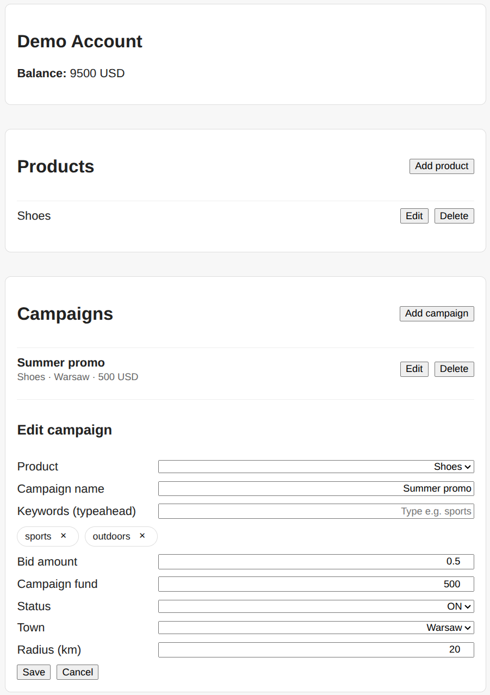

# Campaign Dashboard

Full-stack web app for managing products and advertising campaigns with a demo account balance. The project showcases end-to-end delivery: Angular UI, Spring Boot REST API, business rules around budget reservation, and Dockerized local setup.




## Highlights

- Product and campaign CRUD with robust validation
- Budget reservation and balance reconciliation on create/update/delete
- Campaign targeting with city dictionary, radius, and keyword typeahead
- OpenAPI contract and documented data model
- Docker Compose for one-command local run

## Tech Stack

| Layer | Tech |
|---|---|
| Frontend | Angular 17, TypeScript, RxJS |
| Backend | Spring Boot 4 (Java 21), Spring MVC, JPA/Hibernate, Validation, MapStruct |
| Data | H2 in-memory |
| Ops | Docker Compose |

## Run locally

```bash
docker compose up --build
```

After startup:

| Service | URL |
|---|---|
| Frontend | http://localhost |
| Backend API | http://localhost/api |

## Environment variables (optional)

The backend reads `.env` from the repository root.

| Variable | Default | Description |
|---|---|---|
| `APP_EMERALD_SEED_BALANCE` | `10000.00` | Initial demo account balance |
| `APP_EMERALD_CURRENCY` | `USD` | Demo account currency |

Example:

```env
APP_EMERALD_SEED_BALANCE=5000.00
APP_EMERALD_CURRENCY=EUR
```

## Documentation

- [API contract (OpenAPI)](docs/contract.yaml)
- [Database model](docs/database.md)
